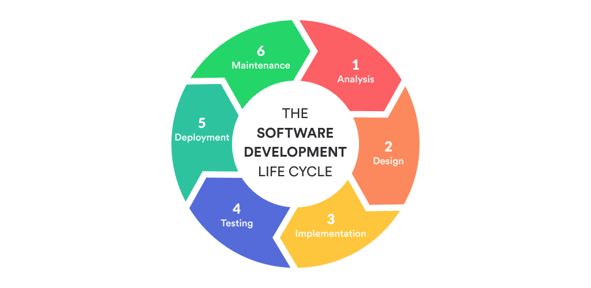
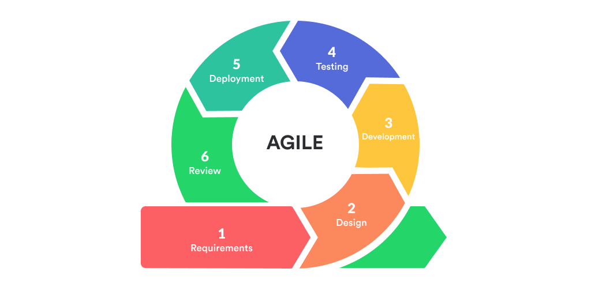

# SDLC VS Agile

## Software Development Life Cycle (SDLC)

SDLC adalah suatu proses yang digunakan di industri software untuk mendesain, mengembangkan dan mencoba suatu software yang berkualitas.

tujuan SDLC adalah menghasilkan software yang berkualitas yang memenuhi harapan atau melebihi harapan pengguna, selesai pada waktu yang ditentukan dengan biaya yang dapat diperkirakan.

ISO/IEC 12207 adalah standar internasional untuk proses lingkaran hidup (life-cycle)

Model SDLC yang populer
- Waterfall Model
- Iterative Model
- Spiral Model
- V-Model
- Big Bang Model

secara umum SDLC proses SDLC dapat digambarkan sebagai

## Agile Software Development

Agile adalah suatu metodologi. Agile Software Development adalah pendekatan pengembangan produk ( Software ) yang selaras dengan nilai-nilai dan prinsip yang dijelaskan di [Agile Manifesto](https://agilemanifesto.org/).

Metodologi Agile bertujuan untuk men-deliver produk yang sesuai  secara bertahap oleh tim yang bekerja mandiri dan multi bidang, yang memungkinkan umpan balik dari customer lebih sehingga koreksi terhadap produk dapat dilakukan sesuai yang dibutuhkan selama proses pengembangan produk.

dapat digambarkan sebagai berikut

- <https://agilemanifesto.org/>
- <https://mlsdev.com/blog/agile-sdlc>
- <https://www.educba.com/sdlc-vs-agile/>
- <https://www.geeksforgeeks.org/difference-between-agile-and-sdlc/>
